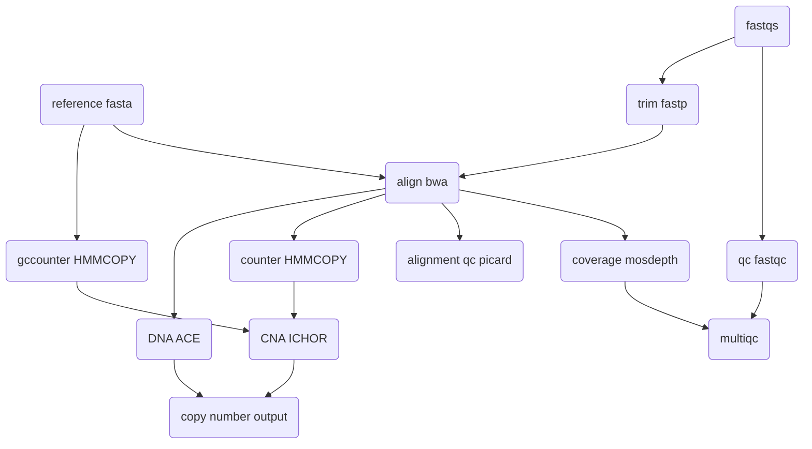

## Introduction

**lp-wgs** is a bioinformatics best-practice analysis pipeline for shallow whole genome sequence analyses.

The pipeline is built using [Nextflow](https://www.nextflow.io), a workflow tool to run tasks across multiple compute infrastructures in a very portable manner. It uses Docker/Singularity containers making installation trivial and results highly reproducible. The [Nextflow DSL2](https://www.nextflow.io/docs/latest/dsl2.html) implementation of this pipeline uses one container per process which makes it much easier to maintain and update software dependencies. Where possible, these processes have been submitted to and installed from [nf-core/modules](https://github.com/nf-core/modules) in order to make them available to all nf-core pipelines, and to everyone within the Nextflow community!

## Pipeline summary

1. Read QC ([`FastQC`](https://www.bioinformatics.babraham.ac.uk/projects/fastqc/))
2. Trim Reads ([`Fastp`](https://github.com/OpenGene/fastp))
3. Align Reads ([`bwa`](https://github.com/lh3/bwa)) (optional: begin from this stage)
4. Coverage ([`mosdepth`](https://github.com/brentp/mosdepth))
5. Alignment QC with ([`picard`](https://broadinstitute.github.io/picard/))
6. GC counts ([`HMMcopy`](http://compbio.bccrc.ca/software/hmmcopy/))
7. read counts ([`HMMcopy`](http://compbio.bccrc.ca/software/hmmcopy/))
8. ICHOR cna calls and tumour cell fraction ([`ICHOR`](https://github.com/broadinstitute/ichorCNA/wiki))
Bin options for ICHOR include 1000kb,500kb,100kb and 10kb these are set with the --map_bin parameter
for ichor the normal fraction and ploids and subclone fractions can be set, see [`here`](https://github.com/broadinstitute/ichorCNA/wiki/Parameter-tuning-and-settings) for low tumour fractions
setting
        --ichor_purity cf_dna
* will set these parameters automatically
        --normal "c(0.95, 0.99, 0.995, 0.999)"  
        --ploidy "c(2)"  
        --maxCN 3  
        --estimateScPrevalence FALSE   
        --scStates "c()"   
        --chrs "c(1:22)"   
        --chrTrain "c(1:22)" 

* otherwise you can set 
       --ichor_purity_manual  c(0.95, 0.99, 0.995, 0.999) which will sent this parameter to ichor
  
       --normal "c(0.95, 0.99, 0.995, 0.999)"


9. ACE Absolute Copy number Estimation using low-coverage whole genome sequencing data ([`ACE`](https://github.com/tgac-vumc/ACE)). The default script for ACE is 
```
library(ACE)
args <- commandArgs(trailingOnly = TRUE)
output_folder <- args[1]
ploidy <- c(2, 3, 4)

runACE(
    outputdir = output_folder, filetype = "bam",
    genome = "hg38", ploidies = ploidy
)
```
10. Collate QC ([`MultiQC`](http://multiqc.info/))




## slurm quick start:

The pipeline will require a csv file with headers describing the paths to samples

1. Starting from fastq example csv:
```
patient,sample,lane,fastq_1,fastq_2
patient1,sample1,1,./data/patient1_sample1_R1.fastq.gz,./data/patient1_sample1_R2.fastq.gz
patient1,sample2,1,./data/patient1_sample2_R1.fastq.gz,./data/patient1_sample2_R2.fastq.gz
patient2,sample1,1,./data/patient2_sample1_R1.fastq.gz,./data/patient2_sample1_R2.fastq.gz
patient2,sample2,1,./data/patient2_sample2_R1.fastq.gz,./data/patient2_sample2_R2.fastq.gz
```
Multi-lane samples are merged automatically with sambamba

example sbatch script:
```
#!/bin/bash -l
#SBATCH --job-name=nextflow
#SBATCH --output=nextflow_out.txt
#SBATCH --partition=master-worker
#SBATCH --ntasks=1
#SBATCH --time=96:00:00

module load java/jdk15.0.1
nextflow run /path/to/lp-wgs \
		--input input_fastq.csv  \
		--outdir results \
		--igenomes_base /path/to/reference \
		--step 'mapping' \
		-c local.config \
		-with-tower \
		-profile singularity \
		-resume
 ```
 note that when starting with fastq you need to add `--step mapping`
 
 note with regard to the reference path it needs to match this pattern:
```
            bwa                   = "${params.igenomes_base}/Homo_sapiens/GATK/GRCh38/Sequence/BWAIndex/"
            dict                  = "${params.igenomes_base}/Homo_sapiens/GATK/GRCh38/Sequence/WholeGenomeFasta/Homo_sapiens_assembly38.dict"
            fasta                 = "${params.igenomes_base}/Homo_sapiens/GATK/GRCh38/Sequence/WholeGenomeFasta/Homo_sapiens_assembly38.fasta"
            fasta_fai             = "${params.igenomes_base}/Homo_sapiens/GATK/GRCh38/Sequence/WholeGenomeFasta/Homo_sapiens_assembly38.fasta.fai"
```
or you can modify the genomes.config file yourself


2. Starting from bam example csv:
```
patient,sample,fastq_1 ,fastq_2
patient1,sample1,./data/patient1_sample1.bam
patient1,sample2,./data/patient1_sample2.bam
patient2,sample1,./data/patient2_sample1.bam
patient2,sample2,./data/patient2_sample2.bam
```
example sbatch script:
```
#!/bin/bash -l
#SBATCH --job-name=nextflow
#SBATCH --output=nextflow_out.txt
#SBATCH --partition=master-worker
#SBATCH --ntasks=1
#SBATCH --time=96:00:00

module load java/jdk15.0.1
nextflow run /path/to/lp-wgs \
		--input input_fastq.csv  \
		--outdir results \
		--igenomes_base /path/to/reference \
		--step 'bam' \
		-c local.config \
		-with-tower \
		-profile singularity \
		-resume
 ```

   Note that some form of configuration will be needed so that Nextflow knows how to fetch the required software. This is usually done in the form of a config profile (`YOURPROFILE` in the example command above). You can chain multiple config profiles in a comma-separated string.

   > - The pipeline comes with config profiles called `docker`, `singularity`, `podman`, `shifter`, `charliecloud` and `conda` which instruct the pipeline to use the named tool for software management. For example, `-profile test,docker`.
   > - Please check [nf-core/configs](https://github.com/nf-core/configs#documentation) to see if a custom config file to run nf-core pipelines already exists for your Institute. If so, you can simply use `-profile <institute>` in your command. This will enable either `docker` or `singularity` and set the appropriate execution settings for your local compute environment.
   > - If you are using `singularity`, please use the [`nf-core download`](https://nf-co.re/tools/#downloading-pipelines-for-offline-use) command to download images first, before running the pipeline. Setting the [`NXF_SINGULARITY_CACHEDIR` or `singularity.cacheDir`](https://www.nextflow.io/docs/latest/singularity.html?#singularity-docker-hub) Nextflow options enables you to store and re-use the images from a central location for future pipeline runs.
   > - If you are using `conda`, it is highly recommended to use the [`NXF_CONDA_CACHEDIR` or `conda.cacheDir`](https://www.nextflow.io/docs/latest/conda.html) settings to store the environments in a central location for future pipeline runs.

4. Start running your own analysis!

   nextflow run lp-wgs --input samplesheet.csv --outdir <OUTDIR> --genome GRCh38 -profile <docker/singularity/podman/shifter/charliecloud/conda/institute>
   ```

## Credits

lp-wgs was originally written by Chela James George Cresswell.

We thank the following people for their extensive assistance in the development of this pipeline:

<!-- TODO nf-core: If applicable, make list of people who have also contributed -->

## Contributions and Support

If you would like to contribute to this pipeline, please see the [contributing guidelines](.github/CONTRIBUTING.md).

## Citations

<!-- TODO nf-core: Add citation for pipeline after first release. Uncomment lines below and update Zenodo doi and badge at the top of this file. -->
<!-- If you use  lp-wgs for your analysis, please cite it using the following doi: [10.5281/zenodo.XXXXXX](https://doi.org/10.5281/zenodo.XXXXXX) -->

<!-- TODO nf-core: Add bibliography of tools and data used in your pipeline -->

An extensive list of references for the tools used by the pipeline can be found in the [`CITATIONS.md`](CITATIONS.md) file.

This pipeline uses code and infrastructure developed and maintained by the [nf-core](https://nf-co.re) community, reused here under the [MIT license](https://github.com/nf-core/tools/blob/master/LICENSE).

> **The nf-core framework for community-curated bioinformatics pipelines.**
>
> Philip Ewels, Alexander Peltzer, Sven Fillinger, Harshil Patel, Johannes Alneberg, Andreas Wilm, Maxime Ulysse Garcia, Paolo Di Tommaso & Sven Nahnsen.
>
> _Nat Biotechnol._ 2020 Feb 13. doi: [10.1038/s41587-020-0439-x](https://dx.doi.org/10.1038/s41587-020-0439-x).
